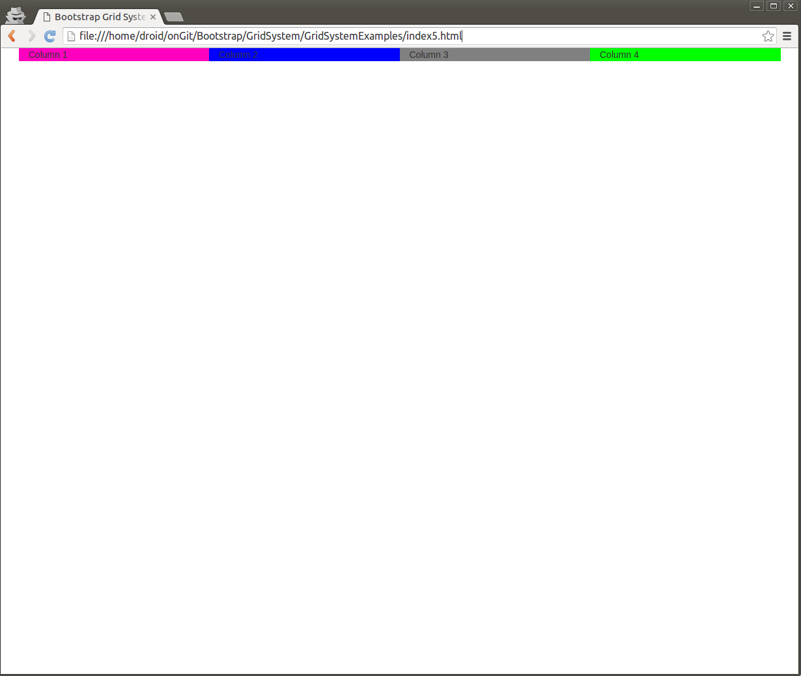

### index.html

```html
<!DOCTYPE html>
<html lang="en">
  <head>
    <meta charset="utf-8">
    <meta http-equiv="X-UA-Compatible" content="IE=edge">
    <meta name="viewport" content="width=device-width, initial-scale=1">

    <title>Bootstrap Grid System Examples</title>
    <link rel="stylesheet" type="text/css" href="bootstrap-3.3.6-dist/css/bootstrap.css">
    <link rel="stylesheet" type="text/css" href="css/colors.css">

    <!--[if lt IE 9]>
      <script src="https://oss.maxcdn.com/libs/html5shiv/3.7.0/html5shiv.js"></script>
      <script src="https://oss.maxcdn.com/libs/respond.js/1.4.2/respond.min.js"></script>
    <![endif]-->
  </head>
  <body>

      <!-- Create a container to hold rows and columns -->
      <div class="container">

        <!-- Create a row -->
        <div class="row">
          <div class="col-xs-1 color1">
            Column 1
          </div>        

          <div class="col-xs-1 color2">
            Column 2
          </div>        

          <div class="col-xs-1 color3">
            Column 3
          </div>                  

          <div class="col-xs-1 color4">
            Column 4
          </div>                  

          <div class="col-xs-1 color5">
            Column 5
          </div>                  

          <div class="col-xs-1 color6">
            Column 6
          </div>                  

          <div class="col-xs-1 color7">
            Column 7
          </div>                  

          <div class="col-xs-1 color8">
            Column 8
          </div>                  

          <div class="col-xs-1 color9">
            Column 9
          </div>                  

          <div class="col-xs-1 color10">
            Col 10
          </div>                  

          <div class="col-xs-1 color11">
            Col 11
          </div>                  

          <div class="col-xs-1 color12">
            Col 12
          </div>                  
        </div>

        <!-- Create a row -->
        <div class="row">
          <div class="col-xs-4 color7">
            Column 1
          </div>        

          <div class="col-xs-4 color4">
            Column 2
          </div>        

          <div class="col-xs-4 color1">
            Column 3
          </div>                  
        </div>
      
        <!-- Create a row -->
        <div class="row">
          <div class="col-xs-6 color6">
            Column 1
          </div>        

          <div class="col-xs-4 color2">
            Column 2
          </div>        

          <div class="col-xs-2 color5">
            Column 3
          </div>                  
        </div>

        <!-- Create a row -->
        <div class="row">
          <div class="col-xs-12 color11">
            Column 1
          </div>        
        </div>        
      </div>      
    
    <script src="jquery/jquery-1.12.0.js"></script>
    <script src="bootstrap-3.3.6-dist/js/bootstrap.js"></script>
  </body>
</html>
```
"Column 3" in third row only has 2 divisions, as a result it got extended and left a blank space i.e. "Column 3" required more space to place its content than the 2 divisions, so it got extended down while the first two entries had enough space, which resulted in the white space.


With the window extended, seems normal


With the window extended a little more, empty space can be seen in first row, because the content of last 3 columns in first row ("col") is shorter than the others in the row ("column"). The content in the first 9 columns required more space when compared to the content of the last 3, so they extended a little down, while the last 3 did not and left a white space.


With the window extended even more, the first 9 columns got enough space to fit in the width as that of the last 3, so the first row seems normal. 


### index1.html

```html
<!DOCTYPE html>
<html lang="en">
  <head>
    <meta charset="utf-8">
    <meta http-equiv="X-UA-Compatible" content="IE=edge">
    <meta name="viewport" content="width=device-width, initial-scale=1">

    <title>Bootstrap Grid System Examples</title>
    <link rel="stylesheet" type="text/css" href="bootstrap-3.3.6-dist/css/bootstrap.css">
    <link rel="stylesheet" type="text/css" href="css/colors.css">

    <!--[if lt IE 9]>
      <script src="https://oss.maxcdn.com/libs/html5shiv/3.7.0/html5shiv.js"></script>
      <script src="https://oss.maxcdn.com/libs/respond.js/1.4.2/respond.min.js"></script>
    <![endif]-->
  </head>
  <body>

      <!-- Create a container to hold rows and columns -->
      <div class="container">

        <!-- Create a row -->
        <div class="row">
          <div class="col-xs-1 color1">
            Column 1
          </div>        

          <div class="col-xs-1 color2">
            Column 2
          </div>        

          <div class="col-xs-1 color3">
            Column 3
          </div>                  

          <div class="col-xs-1 color4">
            Column 4
          </div>                  

          <div class="col-xs-1 color5">
            Column 5
          </div>                  

          <div class="col-xs-1 color6">
            Column 6
          </div>                  

          <div class="col-xs-1 color7">
            Column 7
          </div>                  

          <div class="col-xs-1 color8">
            Column 8
          </div>                  

          <div class="col-xs-1 color9">
            Column 9
          </div>                  

          <div class="col-xs-1 color10">
            Column 10
          </div>                  

          <div class="col-xs-1 color11">
            Column 11
          </div>                  

          <div class="col-xs-1 color12">
            Column 12
          </div>                  
        </div>

        <!-- Create a row -->
        <div class="row">
          <div class="col-xs-1 color1">
            Column 1
          </div>        

          <div class="col-xs-1 color2">
            Column 2
          </div>        

          <div class="col-xs-1 color3">
            Column 3
          </div>                  

          <div class="col-xs-1 color4">
            Column 4
          </div>                  

          <div class="col-xs-1 color5">
            Column 5
          </div>                  

          <div class="col-xs-1 color6">
            Column 6
          </div>                  

          <div class="col-xs-1 color7">
            Column 7
          </div>                  

          <div class="col-xs-1 color8">
            Column 8
          </div>                  

          <div class="col-xs-1 color9">
            Column 9
          </div>                  

          <div class="col-xs-1 color10">
            Col 10
          </div>                  

          <div class="col-xs-1 color11">
            Col 11
          </div>                  

          <div class="col-xs-1 color12">
            Col 12
          </div>                  
        </div>

      </div>      
    
    <script src="jquery/jquery-1.12.0.js"></script>
    <script src="bootstrap-3.3.6-dist/js/bootstrap.js"></script>
  </body>
</html>
```


###index2.html

```html
<!DOCTYPE html>
<html lang="en">
  <head>
    <meta charset="utf-8">
    <meta http-equiv="X-UA-Compatible" content="IE=edge">
    <meta name="viewport" content="width=device-width, initial-scale=1">

    <title>Bootstrap Grid System Examples</title>
    <link rel="stylesheet" type="text/css" href="bootstrap-3.3.6-dist/css/bootstrap.css">
    <link rel="stylesheet" type="text/css" href="css/colors.css">

    <!--[if lt IE 9]>
      <script src="https://oss.maxcdn.com/libs/html5shiv/3.7.0/html5shiv.js"></script>
      <script src="https://oss.maxcdn.com/libs/respond.js/1.4.2/respond.min.js"></script>
    <![endif]-->
  </head>
  <body>

      <!-- Create a container to hold rows and columns -->
      <div class="container">
        <!-- Create a row -->
        <div class="row">
          <div class="col-xs-12 color11">
            Column 1
          </div>        

          <div class="col-xs-12 color5">
            Column 2
          </div>        

          <div class="col-xs-12 color7">
            Column 3
          </div>        

          <div class="col-xs-12 color9">
            Column 4
          </div>        

        </div>        
      </div>      
    
    <script src="jquery/jquery-1.12.0.js"></script>
    <script src="bootstrap-3.3.6-dist/js/bootstrap.js"></script>
  </body>
</html>
```


###index3.html

```html
<!DOCTYPE html>
<html lang="en">
  <head>
    <meta charset="utf-8">
    <meta http-equiv="X-UA-Compatible" content="IE=edge">
    <meta name="viewport" content="width=device-width, initial-scale=1">

    <title>Bootstrap Grid System Examples</title>
    <link rel="stylesheet" type="text/css" href="bootstrap-3.3.6-dist/css/bootstrap.css">
    <link rel="stylesheet" type="text/css" href="css/colors.css">

    <!--[if lt IE 9]>
      <script src="https://oss.maxcdn.com/libs/html5shiv/3.7.0/html5shiv.js"></script>
      <script src="https://oss.maxcdn.com/libs/respond.js/1.4.2/respond.min.js"></script>
    <![endif]-->
  </head>
  <body>

      <!-- Create a container to hold rows and columns -->
      <div class="container">
        <!-- Create a row -->
        <div class="row">
          <div class="col-xs-12 col-sm-6 color11">
            Column 1
          </div>        

          <div class="col-xs-12 col-sm-6 color5">
            Column 2
          </div>        

          <div class="col-xs-12 col-sm-6 color7">
            Column 3
          </div>        

          <div class="col-xs-12 col-sm-6 color9">
            Column 4
          </div>        

        </div>        
      </div>      
    
    <script src="jquery/jquery-1.12.0.js"></script>
    <script src="bootstrap-3.3.6-dist/js/bootstrap.js"></script>
  </body>
</html>
```


###index4.html

```html
<!DOCTYPE html>
<html lang="en">
  <head>
    <meta charset="utf-8">
    <meta http-equiv="X-UA-Compatible" content="IE=edge">
    <meta name="viewport" content="width=device-width, initial-scale=1">

    <title>Bootstrap Grid System Examples</title>
    <link rel="stylesheet" type="text/css" href="bootstrap-3.3.6-dist/css/bootstrap.css">
    <link rel="stylesheet" type="text/css" href="css/colors.css">

    <!--[if lt IE 9]>
      <script src="https://oss.maxcdn.com/libs/html5shiv/3.7.0/html5shiv.js"></script>
      <script src="https://oss.maxcdn.com/libs/respond.js/1.4.2/respond.min.js"></script>
    <![endif]-->
  </head>
  <body>

      <!-- Create a container to hold rows and columns -->
      <div class="container">
        <!-- Create a row -->
        <div class="row">
          <div class="col-xs-12 col-sm-6 col-md-4 color11">
            Column 1
          </div>        

          <div class="col-xs-12 col-sm-6 col-md-4 color5">
            Column 2
          </div>        

          <div class="col-xs-12 col-sm-6 col-md-4 color7">
            Column 3
          </div>        

          <div class="col-xs-12 col-sm-6 col-md-4 color9">
            Column 4
          </div>        

        </div>        
      </div>      
    
    <script src="jquery/jquery-1.12.0.js"></script>
    <script src="bootstrap-3.3.6-dist/js/bootstrap.js"></script>
  </body>
</html>
```


###index5.html

```html
<!DOCTYPE html>
<html lang="en">
  <head>
    <meta charset="utf-8">
    <meta http-equiv="X-UA-Compatible" content="IE=edge">
    <meta name="viewport" content="width=device-width, initial-scale=1">

    <title>Bootstrap Grid System Examples</title>
    <link rel="stylesheet" type="text/css" href="bootstrap-3.3.6-dist/css/bootstrap.css">
    <link rel="stylesheet" type="text/css" href="css/colors.css">

    <!--[if lt IE 9]>
      <script src="https://oss.maxcdn.com/libs/html5shiv/3.7.0/html5shiv.js"></script>
      <script src="https://oss.maxcdn.com/libs/respond.js/1.4.2/respond.min.js"></script>
    <![endif]-->
  </head>
  <body>

      <!-- Create a container to hold rows and columns -->
      <div class="container">
        <!-- Create a row -->
        <div class="row">
          <div class="col-xs-12 col-sm-6 col-md-4 col-lg-3 color11">
            Column 1
          </div>        

          <div class="col-xs-12 col-sm-6 col-md-4 col-lg-3 color5">
            Column 2
          </div>        

          <div class="col-xs-12 col-sm-6 col-md-4 col-lg-3 color7">
            Column 3
          </div>        

          <div class="col-xs-12 col-sm-6 col-md-4 col-lg-3 color9">
            Column 4
          </div>        

        </div>        
      </div>      
    
    <script src="jquery/jquery-1.12.0.js"></script>
    <script src="bootstrap-3.3.6-dist/js/bootstrap.js"></script>
  </body>
</html>
```



